# 📊 Fluxograma ClientePro

Documentação visual completa dos fluxos e arquitetura do sistema.

---

## 🏗️ Arquitetura Geral do Sistema

```mermaid
graph TB
    subgraph "Frontend - React + Vite"
        UI[Interface Web PWA]
        Routes[React Router]
        Context[Context Providers]
        Components[Componentes]
    end
    
    subgraph "Backend - Express + Node.js"
        API[API REST]
        Auth[Autenticação JWT]
        Services[Serviços]
        Prisma[Prisma ORM]
    end
    
    subgraph "Banco de Dados"
        SQLite[(SQLite - Dev)]
        PostgreSQL[(PostgreSQL - Prod)]
    end
    
    subgraph "Integrações Externas"
        Google[Google Calendar API]
        Gemini[Google Gemini AI]
        Twilio[Twilio SMS]
        Maps[Google Maps]
    end
    
    UI --> Routes
    Routes --> Components
    Components --> Context
    Context --> API
    
    API --> Auth
    Auth --> Services
    Services --> Prisma
    
    Prisma --> SQLite
    Prisma -.Produção.-> PostgreSQL
    
    Services --> Google
    Services --> Gemini
    Services --> Twilio
    Components --> Maps
    
    style UI fill:#10b981
    style API fill:#3b82f6
    style SQLite fill:#f59e0b
    style PostgreSQL fill:#f59e0b
```



---

## 👤 Fluxo de Autenticação

```mermaid
sequenceDiagram
    participant User
    participant Frontend
    participant Backend
    participant Database
    participant Google

    User->>Frontend: Acessa app
    Frontend->>Frontend: Verifica token local
    
    alt Token Válido
        Frontend->>Backend: GET /api/user/me
        Backend->>Database: Busca usuário
        Database-->>Backend: Dados do usuário
        Backend-->>Frontend: User data
        Frontend->>Frontend: Redireciona para /app
    else Sem Token ou Inválido
        Frontend->>Frontend: Mostra tela de login
        User->>Frontend: Clica "Login com Google"
        Frontend->>Google: OAuth2 Request
        Google-->>User: Tela de autorização
        User->>Google: Autoriza
        Google-->>Frontend: Auth Code
        Frontend->>Backend: POST /api/auth/google
        Backend->>Google: Valida token
        Google-->>Backend: User info
        Backend->>Database: Cria/Atualiza usuário
        Backend-->>Frontend: JWT Token
        Frontend->>Frontend: Salva token
        Frontend->>Frontend: Redireciona para /app
    end
```



---

## 📅 Fluxo de Agendamento

```mermaid
graph TD
    Start[Usuário na Agenda] --> ViewMode{Escolhe Visualização}
    
    ViewMode -->|Hoje| TodayView[View: Hoje]
    ViewMode -->|Semana| WeekView[View: Semana]
    ViewMode -->|Mês| MonthView[View: Mês]
    
    TodayView --> SelectDay[Seleciona Dia]
    WeekView --> SelectDay
    MonthView --> SelectDay
    
    SelectDay --> AddBtn[Clica + Adicionar]
    AddBtn --> CreateModal[Modal de Criação]
    
    CreateModal --> FillForm[Preenche Formulário]
    FillForm --> SelectCustomer[Seleciona Cliente]
    FillForm --> SetDateTime[Define Data/Hora]
    FillForm --> SetPrice[Define Preço]
    FillForm --> Recurring{Recorrente?}
    
    Recurring -->|Sim| SetRule[Define Regra RRULE]
    Recurring -->|Não| TeamMode{Team Mode?}
    SetRule --> TeamMode
    
    TeamMode -->|Sim| AssignHelper[Atribui Helper + Fee]
    TeamMode -->|Não| Submit[Submete Formulário]
    AssignHelper --> Submit
    
    Submit --> Backend[POST /api/appointments]
    Backend --> CreateDB[Cria no Database]
    CreateDB --> GoogleSync{Google Calendar?}
    
    GoogleSync -->|Conectado| SyncGoogle[Sincroniza com Google]
    GoogleSync -->|Não| RefreshView[Atualiza View]
    SyncGoogle --> RefreshView
    
    RefreshView --> End[Agendamento Criado]
    
    style Start fill:#10b981
    style End fill:#10b981
    style CreateModal fill:#3b82f6
    style Backend fill:#f59e0b
```



---

## 💰 Fluxo Financeiro

```mermaid
graph TB
    Start[Agendamento Concluído] --> Complete[Marcar como Concluído]
    Complete --> CompModal[Modal de Conclusão]
    
    CompModal --> SetPrice[Define Preço Final]
    SetPrice --> PayStatus{Status Pagamento}
    
    PayStatus -->|Pago| CreatePaid[Cria Transação PAGA]
    PayStatus -->|Pendente| CreatePending[Cria Transação PENDENTE]
    
    CreatePaid --> FinanceView[Exibe em Financeiro]
    CreatePending --> FinanceView
    
    FinanceView --> PendingList[Lista: Pendentes]
    FinanceView --> PaidList[Lista: Recebidos]
    
    PendingList --> ClickCard[Clica em Card Pendente]
    ClickCard --> InvoiceDrawer[Abre Invoice Drawer]
    
    InvoiceDrawer --> ShowDetails[Mostra Detalhes]
    ShowDetails --> GenLink[Gera Link de Pagamento]
    GenLink --> ShareOptions{Como Compartilhar?}
    
    ShareOptions -->|Copiar| CopyLink[Copia Link]
    ShareOptions -->|Email| SendEmail[Envia por Email 📧]
    ShareOptions -->|SMS| SendSMS[Envia por SMS 💬]
    ShareOptions -->|Ambos| SendBoth[Envia Email + SMS]
    
    CopyLink --> End[Cliente Recebe Link]
    SendEmail --> End
    SendSMS --> End
    SendBoth --> End
    
    End --> CustomerPay[Cliente Paga via Link]
    CustomerPay --> UpdateStatus[Atualiza Status: PAGO]
    
    style Start fill:#10b981
    style InvoiceDrawer fill:#3b82f6
    style CustomerPay fill:#f59e0b
    style UpdateStatus fill:#10b981
```



---

## 🤖 Fluxo de IA (Gemini AI)

```mermaid
graph TD
    Start[Módulo Vendas] --> FeatureSelect{Seleciona Ferramenta}
    
    FeatureSelect -->|Social Media| SocialFlow[Social Media Studio]
    FeatureSelect -->|Flash Offer| OfferFlow[Flash Offer Radar]
    FeatureSelect -->|Silent Seller| SellerFlow[Silent Seller]
    
    SocialFlow --> Format[Escolhe Formato]
    Format --> Upload[Upload de Imagens]
    Upload --> Prompt[Define Prompt]
    Prompt --> CallGemini[Chama Gemini API]
    CallGemini --> GenerateCaption[Gera Caption + Hashtags]
    GenerateCaption --> Preview[Preview Instagram-style]
    Preview --> Share[Compartilhar ou Baixar]
    
    OfferFlow --> SelectCustomers[Seleciona Clientes Inativos]
    SelectCustomers --> AIAnalyze[IA Analisa Histórico]
    AIAnalyze --> GenOffer[Gera Oferta Personalizada]
    GenOffer --> ReviewOffer[Revisa Oferta]
    ReviewOffer --> SendOffer[Envia via SMS/Email]
    
    SellerFlow --> TrackVisits[Rastreia Visitas]
    TrackVisits --> AIDetect[IA Detecta Oportunidades]
    AIDetect --> SuggestUpgrade[Sugere Upgrade]
    SuggestUpgrade --> AutoMessage[Mensagem Automática]
    
    Share --> End[Publicado]
    SendOffer --> End
    AutoMessage --> End
    
    style Start fill:#a855f7
    style CallGemini fill:#f59e0b
    style AIAnalyze fill:#f59e0b
    style AIDetect fill:#f59e0b
    style End fill:#10b981
```



---

## 💬 Fluxo de SMS Bidirecional (Twilio)

```mermaid
sequenceDiagram
    participant User as Usuário (App)
    participant Frontend
    participant Backend
    participant Twilio
    participant Customer as Cliente (SMS)
    participant Router as SMS Router

    User->>Frontend: Clica em "Enviar SMS"
    Frontend->>Backend: POST /api/sms/send
    Backend->>Twilio: Send SMS
    Twilio-->>Customer: SMS Recebido
    
    Customer->>Twilio: Responde SMS
    Twilio->>Backend: POST /webhooks/twilio (Inbound)
    Backend->>Backend: Valida Signature
    Backend->>Router: Route Message
    
    Router->>Router: Verifica Router Links
    
    alt Link Existente
        Router->>Backend: Atribui ao Usuário Correto
    else Cliente Único
        Router->>Backend: Match por Phone E164
    else Múltiplos Matches (Conflito)
        Router->>Backend: Cria InboundConflict
        Backend-->>User: Notifica Conflito
        User->>Frontend: Resolve Manualmente
        Frontend->>Backend: POST /api/sms/resolve-conflict
        Backend->>Router: Cria Router Link
    end
    
    Backend->>Backend: Salva Mensagem
    Backend->>Frontend: WebSocket/Polling Update
    Frontend-->>User: Mostra Nova Mensagem
    
    style Twilio fill:#f59e0b
    style Router fill:#3b82f6
```

---

## 🗺️ Fluxo de Navegação e Rotas

```mermaid
graph TD
    Start[App Inicia] --> Auth{Autenticado?}
    
    Auth -->|Não| Login[/login]
    Auth -->|Sim| App[/app]
    
    Login --> GoogleAuth[Login Google]
    GoogleAuth --> App
    
    App --> Nav{Navegação Principal}
    
    Nav --> Agenda[/app/agenda]
    Nav --> Clients[/app/clientes]
    Nav --> Finance[/app/financeiro]
    Nav --> More[/app + Menu]
    
    Agenda --> AgendaViews{View Mode}
    AgendaViews --> Today[Hoje]
    AgendaViews --> Week[Semana]
    AgendaViews --> Month[Mês]
    AgendaViews --> Chat[💬 Chat IA - Planejado]
    
    Clients --> ClientList[Lista de Clientes]
    ClientList --> ClientDetail[Detalhes Cliente]
    ClientDetail --> ClientHistory[Histórico de Serviços]
    
    Finance --> FinanceDash[Dashboard]
    FinanceDash --> Pending[Pendentes]
    FinanceDash --> Received[Recebidos]
    Pending --> InvoiceDrawer[Invoice Drawer]
    
    More --> Team[Equipe]
    More --> Sales[Vendas]
    More --> Routes[Rotas/GPS]
    More --> Settings[Configurações]
    
    Sales --> SocialMedia[Social Media Studio]
    Sales --> FlashOffer[Flash Offer Radar]
    Sales --> SilentSeller[Silent Seller - Planejado]
    
    Routes --> MapView[Mapa com Clientes]
    MapView --> OptimizeRoute[Otimizar Rota - Planejado]
    
    style Start fill:#10b981
    style App fill:#3b82f6
    style Sales fill:#a855f7
```

---

## 📱 Portal do Cliente (Magic Link)

```mermaid
sequenceDiagram
    participant Business as Empresário
    participant Backend
    participant Customer as Cliente
    participant Portal as Portal Web

    Business->>Backend: Completa Serviço
    Backend->>Backend: Gera Magic Link Token
    Backend->>Customer: Envia Link por SMS/Email
    
    Customer->>Portal: Clica no Link
    Portal->>Backend: GET /portal/:token
    Backend->>Backend: Valida Token
    Backend-->>Portal: Autentica Cliente
    
    Portal->>Portal: Dashboard do Cliente
    Portal->>Backend: GET /api/client-portal/history
    Backend-->>Portal: Histórico de Serviços
    
    Portal->>Backend: GET /api/client-portal/invoices
    Backend-->>Portal: Faturas Pendentes
    
    Customer->>Portal: Visualiza Invoice
    Portal->>Customer: Exibe Detalhes + Link Pagamento
    
    Customer->>Portal: Clica "Pagar"
    Portal->>PaymentGateway: Redireciona - Planejado
    
    style Portal fill:#10b981
    style PaymentGateway fill:#f59e0b
```

---

## 🎯 Funcionalidades Implementadas vs Planejadas

### ✅ Implementado

- [x] Autenticação Google OAuth2
- [x] CRUD Completo de Clientes
- [x] CRUD Completo de Agendamentos
- [x] Agendamentos Recorrentes (RRULE)
- [x] Team Mode (Helpers + Commission)
- [x] Google Calendar Sync
- [x] Visualizações: Hoje, Semana, Mês
- [x] Sistema Financeiro (Transações)
- [x] Invoice Drawer (Geração de Link)
- [x] Social Media Studio (Gemini AI)
- [x] SMS Bidirecional (Twilio)
- [x] SMS Router (Fail-safe, Conflict Detection)
- [x] Portal do Cliente (Magic Link)
- [x] PWA (Progressive Web App)
- [x] Dark Mode
- [x] Responsivo Mobile-First

### 🚧 Planejado / Em Desenvolvimento

- [ ] Chat IA na Agenda (Assistente conversacional)
- [ ] Sistema de Pagamentos Online (Stripe/Square)
- [ ] Flash Offer Radar (IA para ofertas)
- [ ] Silent Seller (Detecção automática de oportunidades)
- [ ] Otimização de Rotas (GPS + IA)
- [ ] Cleaner Tracker (Timeline vertical de progresso)
- [ ] Notificações Push (Web Push API)
- [ ] Exportação para Excel/PDF
- [ ] Relatórios Financeiros Avançados
- [ ] Multi-idioma (i18n)
- [ ] Automação de Mensagens Programadas
- [ ] Dashboard Analytics

---

## 🔐 Variáveis de Ambiente Necessárias

### Backend (.env)
```env
DATABASE_URL=                    # SQLite local ou PostgreSQL prod
JWT_SECRET=                      # Secret para tokens
GOOGLE_CLIENT_ID=                # OAuth2 Google
GOOGLE_CLIENT_SECRET=            # OAuth2 Google
GEMINI_API_KEY=                  # Google Gemini AI
TWILIO_ACCOUNT_SID=              # Twilio SMS
TWILIO_AUTH_TOKEN=               # Twilio SMS
TWILIO_PHONE_NUMBER=             # Número Twilio
TWILIO_WEBHOOK_URL=              # URL para webhooks
```

### Frontend (.env)
```env
VITE_API_URL=http://localhost:5000   # URL do backend
VITE_GOOGLE_MAPS_API_KEY=            # Google Maps (opcional)
```

---

## 📊 Estatísticas do Projeto

| Métrica | Valor |
|---------|-------|
| **Usuários Cadastrados** | 16 |
| **Clientes** | 51 |
| **Agendamentos** | 560 |
| **Contratos (Helpers)** | 5 |
| **Módulos Principais** | 9 |
| **Rotas de API** | ~40 |
| **Componentes React** | ~35 |
| **Tabelas no DB** | 14 |

---

## 🚀 Deploy Stack Recomendada


---

**Última Atualização:** 2026-01-13  
**Versão:** 1.0  
**Status:** Em Desenvolvimento Ativo
